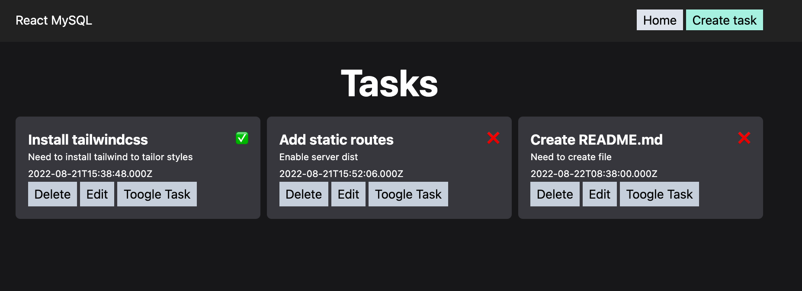
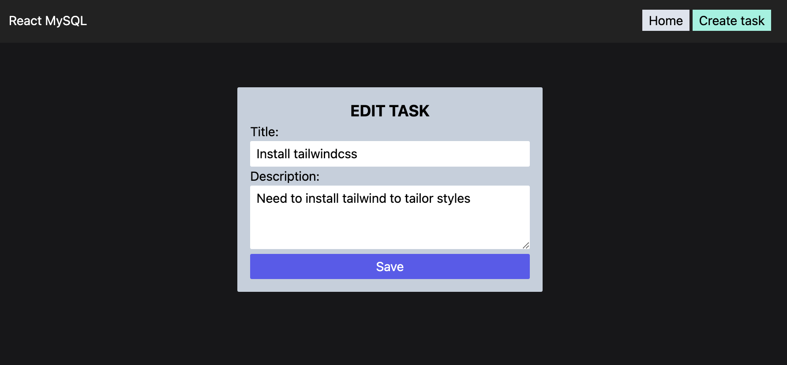

<!-- PROJECT TITLE -->
<br />
<div align="center">

<h2 align="center">MERN STACK</h3>
<p align="center"> This is a simple MERN web project</p>
<br />
</div>
<br/>

## About the project

In order to achieve a broader knowledge in tech stacks I've created this simple project that combines the use of M. MySQL, E. Express, R. React, N. Node.js.

Here's why -> :rocket: [go fullstack!](https://martaboteller.com/fullstack)

<br/><br/>

## Description

<h5>I've followed this <a href="https://www.youtube.com/watch?v=dJbd7BYofp4">tutorial</a> from FaztCode. In this course I've developed a fullstack web app using the MERN stack (MySQL, Express, React, Node). We've started creating the server side using Javascript and Node.js with Express. We've used a Docker container for the MySQL database. Finally we've created the frontend with Vite (instead of create-react-app). This app allows us to save tasks using the typical CRUD squeme (Create, Read, Update, Delete). </h5>





<br/><br/>

## Built with

Major frameworks/libraries used:

  

  

  

  
  
<br/><br/>

## What's included

I've been working with two main folders: client & server.

The structure of the client is as follows:

```
client/
├── src/
│   ├─── api/
│   │    └─── tasks.api.js
│   ├─── components/
│   │    ├─── Navbar.jsx
│   │    └─── TaskCard.jsx
│   ├─── context/
│   │    ├─── TaskContext.jsx
│   │    └─── TaskProvider.jsx
│   ├─── pages/
│   │    ├─── NotFound.jsx
│   │    ├─── TaskForm.jsx
│   │    └─── TaskPage.jsx
│   ├─── App.css
│   ├─── App.jsx
│   ├─── index.css
│   └─── main.jsx
│
├── index.html
├── tailwind.config.cjs
└── vite.config.cjs
```

The database:

```
database/
└── db.sql
```

And the structure of the server is as follows:

```
server/
├── controllers/
│   └── tasks.controller.js
├── routes/
│   ├── index.routes.js
│   └── tasks.routes.js
├── config.js
├── db.js
└── index.js
```

<br/><br/>

## Creating MySQL database using Docker

<br/>
<h5>Create a docker repo:</h5>

```
docker pull mysql
```

<h5>Check if image has been created:</h5>

```
docker images
```

<h5>Create database (change < mypass >):</h5>

```
docker run --name mymysql -e MYSQL_ROOT_PASSWORD=<mypass> -e MYSQL_DATABASE=tasksdb -p 3306:3306 -d mysql
```

<h5>List containers:</h5>

```
docker ps
```

<h5>Execute mysql server:</h5>

```
docker exec -it mymysql bash
```

<h5>Access database:</h5>

```
mysql -u root --password
Enter password:
```

<h5>Inside sql:</h5>

```
mysql>show databases;
mysql> exit
mysql> use tasksdb;
```

<br/><br/>

## Creating React app with Vite

<br/>
<h5>Initialize Vite with:</h5>

```
npm init vite
```

<h5>Select react framework and react (instead react-ts). Execute with:</h5>

```
npm run dev
```

<br/><br/>

## Use Tailwindcss

<br/>
<h5>Install and execute in client folder. Follow guidelines <a href="https://tailwindcss.com/docs/guides/vite">here:</a></h5>

```
npm install -D tailwindcss postcss autoprefixer
npx tailwindcss init -p
```

<br/><br/>

## Roadmap

- [x] Configure Docker container with MySQL
- [x] Configure with Context
- [x] Use Formik <a href="https://formik.org/">(+ info)</a>
- [x] Resposive frontend
- [ ] Use global variables

<br/>

## Author

I'm Marta Boteller, little more about me at my [website](https://martaboteller.com).

<br/> <br/>

## Acknowledgments

<p>Authors like FaztCode help us keep learning with ease. Please see his <a href="https://faztweb.com/">site</a> and Youtube channels: <a href="https://www.youtube.com/c/FaztTech">faztTech</a> and <a href="https://www.youtube.com/c/faztcode">faztCode</a>.</p>
